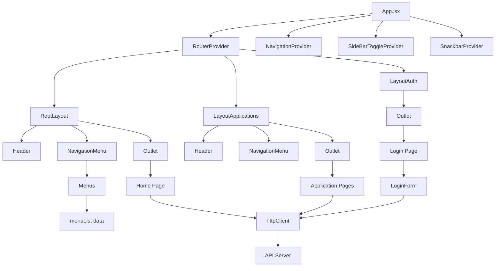

# Duralux Admin Dashboard - Project Architecture

## Overview

This is a React-based admin dashboard application built with modern web technologies. The application serves as a content management system for managing various aspects of a business including users, students, schools, products, orders, payments, and reports.

## Technology Stack

- **Frontend Framework**: React 18
- **State Management**: React Context API, useState, useEffect
- **Routing**: React Router v6
- **UI Components**: Material-UI (MUI) v7, Bootstrap 5
- **Styling**: SCSS/CSS
- **HTTP Client**: Axios
- **Icons**: React Icons
- **Build Tool**: Vite
- **Charts**: ApexCharts
- **Data Grid**: MUI X Data Grid
- **Forms**: React Hook Form (implied)
- **Notifications**: Notistack
- **Rich Text Editor**: React Quill

## Project Structure

```
├── public/                 # Static assets
│   ├── assets/             # Images, styles, and other static files
│   └── images/             # Various image assets
├── src/
│   ├── components/         # Reusable UI components
│   ├── contentApi/         # Context providers for global state
│   ├── hooks/              # Custom React hooks
│   ├── layout/             # Layout components
│   ├── pages/              # Page components
│   ├── route/              # Routing configuration
│   ├── styles/             # Global styles
│   ├── utils/              # Utility functions and helpers
│   ├── App.jsx             # Main application component
│   └── main.jsx            # Application entry point
├── package.json            # Project dependencies and scripts
└── README.md               # Project documentation
```

## Core Components

### 1. Application Entry Point

- **File**: `src/App.jsx`
- **Responsibilities**:
  - Sets up the main application structure
  - Configures routing with RouterProvider
  - Wraps application with context providers (NavigationProvider, SideBarToggleProvider)
  - Integrates SnackbarProvider for notifications

### 2. Routing System

- **File**: `src/route/router.jsx`
- **Key Features**:
BrowserRouter
  - Implements multiple layout structures (RootLayout, LayoutApplications, LayoutAuth)
  - Handles routes for all major sections: users, students, schools, contents, products, orders, payments, reports
  - Authentication routes for login

### 3. Layout Components

- **Root Layout** (`src/layout/root.jsx`): Main dashboard layout with header and navigation
- **Applications Layout** (`src/layout/layoutApplications.jsx`): Layout for application pages with specific styling
- **Auth Layout** (`src/layout/layoutAuth.jsx`): Simple layout for authentication pages

### 4. Navigation System

- **Navigation Provider** (`src/contentApi/navigationProvider.jsx`): Context for managing navigation state
- **Navigation Menu** (`src/components/shared/navigationMenu/NavigationMenu.jsx`): Main navigation sidebar
- **Menu Component** (`src/components/shared/navigationMenu/Menus.jsx`): Renders menu items from menuList data
- **Menu Data** (`src/utils/fackData/menuList.js`): Static menu configuration

### 5. Authentication

- **Login Form** (`src/components/authentication/LoginForm.jsx`): Handles user authentication
- **HTTP Client** (`src/utils/httpClinet.js`): Axios instance with interceptors for authentication
- **Auth Layout** (`src/layout/layoutAuth.jsx`): Dedicated layout for authentication pages

### 6. User Management

- **User List** (`src/pages/users/Users.jsx`): Displays users in a data grid with actions
- **Add User** (`src/pages/users/AddUser.jsx`): Form for creating new users
- **Edit User** (`src/pages/users/EditUser.jsx`): Form for editing existing users

### 7. Utility Functions

- **HTTP Client** (`src/utils/httpClinet.js`): Configured Axios instance with request/response interceptors
- **Icon Utility** (`src/utils/getIcon.jsx`): Maps icon names to React Icons components
- **Fake Data** (`src/utils/fackData/`): Static data for menus and other UI elements

## Data Flow and State Management

### HTTP Client

The application uses a custom Axios instance (`src/utils/httpClinet.js`) for all HTTP requests:
- Base URL configured for API server
- Request interceptor adds authorization header with JWT token from localStorage
- Response interceptor handles responses

### Context Providers

- **Navigation Context** (`src/contentApi/navigationProvider.jsx`): Manages sidebar navigation state
- **Sidebar Toggle Context** (`src/contentApi/sideBarToggleProvider.jsx`): Manages sidebar toggle state

### Component State

- Local component state managed with React's useState hook
- Form data typically stored in component state
- Loading states for async operations

## Key Features and Functionality

### 1. Dashboard

- Main dashboard displaying content from `/dashboard/get-dashboard-contents` endpoint

### 2. User Management

- List all users with pagination
- Add new users with comprehensive permission settings
- Edit existing users
- Delete users with confirmation

### 3. Student Management

- List and add students

### 4. School Management

- List, add, and edit schools
- Additional school-related configurations

### 5. Content Management

- Sitemap management
- Home page content sections
- Social media content (Facebook, Twitter)
- Catalog management (Senior, Class Ring)
- Custom photography content
- Contact us page content
- Online orders configuration
- Online payments configuration
- FAQ management
- Basic content sections (Recognition, Legal, etc.)

### 6. Product & Package Management

- Product listing
- Category management
- Package management

### 7. Orders & Payments

- Order management
- Payment management

### 8. Reports

- Report builder
- Standard reports
- School-specific reports
- Item reports
- Office reports

### 9. Authentication

- Login functionality
- JWT token storage in localStorage

## Component Relationships



## Development Workflow

### Available Scripts

- `npm run dev`: Start development server
- `npm run build`: Build for production
- `npm run lint`: Run ESLint
- `npm run preview`: Preview production build

### Development Tools

- Vite for fast development and building
- ESLint for code quality
- Sass for styling

## Key Design Patterns

### 1. Layout Pattern

The application uses multiple layout components to provide consistent structure across different sections:
- Root layout for main dashboard
- Applications layout for feature pages
- Auth layout for authentication pages

### 2. Context Pattern

React Context API is used for global state management:
- Navigation state
- Sidebar toggle state

### 3. Component Composition

UI components are built using composition:
- Reusable form components
- Data grid components
- Layout components

### 4. HTTP Interception

Axios interceptors are used to handle:
- Authentication token injection
- Response handling

## Security Considerations

1. **Authentication**: JWT tokens stored in localStorage
2. **Authorization**: User permissions managed through form fields
3. **Data Validation**: Client-side validation in forms
4. **Error Handling**: Proper error handling in HTTP requests

## Performance Considerations

1. **Code Splitting**: React Router enables route-based code splitting
2. **Lazy Loading**: Components loaded on demand
3. **Optimized Rendering**: Use of React.memo and useCallback where appropriate
4. **Bundle Optimization**: Vite's built-in optimizations

## Future Improvements

1. **State Management**: Consider Redux or Zustand for complex state
2. **Form Management**: Implement React Hook Form for complex forms
3. **Testing**: Add unit and integration tests
4. **Type Safety**: Add TypeScript support
5. **Error Boundaries**: Implement error boundaries for better error handling
  - Uses React Router v6 with create
